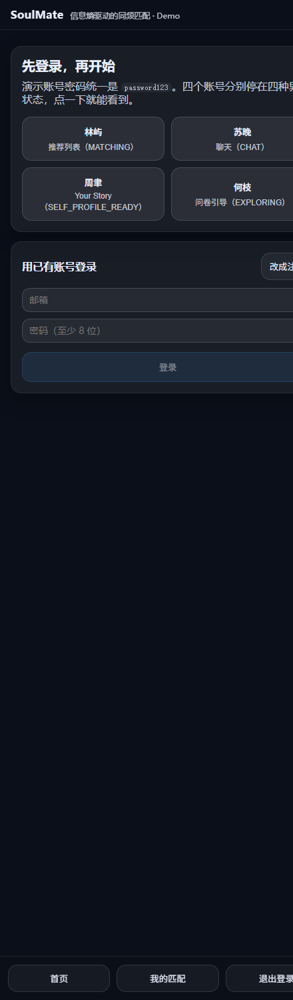
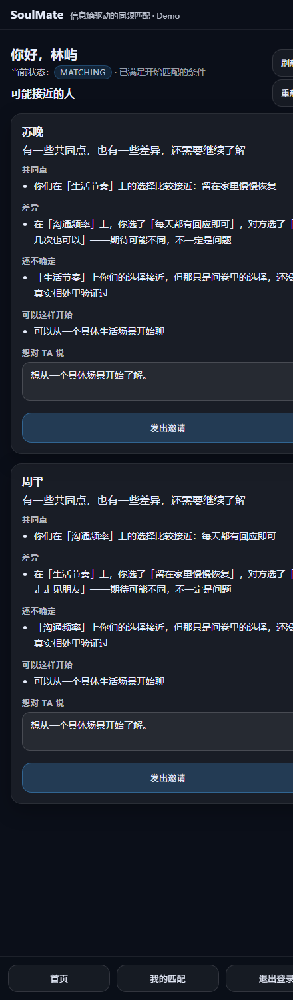
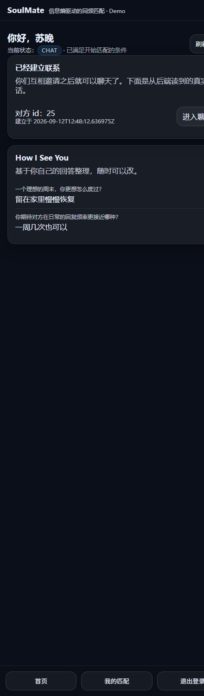
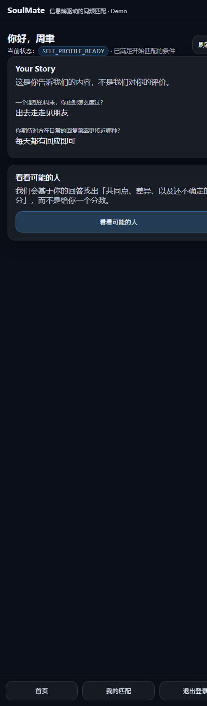
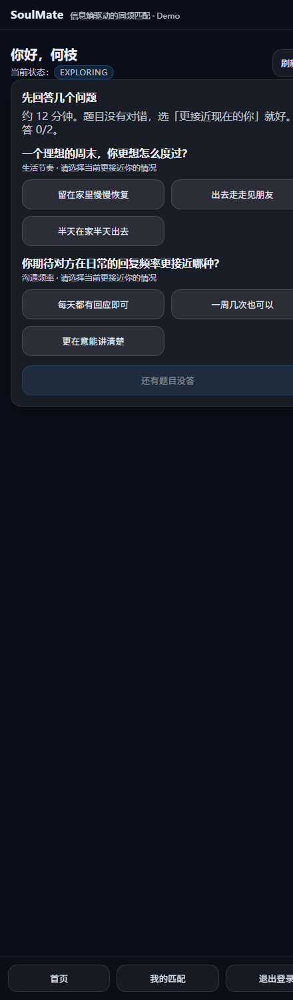

# SoulMate Demo

一个**能直接跑起来**的前后端联调 demo：Next.js 前端 + FastAPI 后端，
走同源代理、CSRF 双提交、由 `/api/v1/space/state` 驱动的四种界面状态、WebSocket 实时聊天。

## 一键启动

```powershell
cd <repo>\soulmate\demo
.\start.ps1
```

脚本会依次：迁移数据库 → 灌演示数据 → 选一个空闲端口起后端（默认 8010，见下）→ 装前端依赖（首次）→ 起前端（`127.0.0.1:3000`）→ 打开浏览器。
按 `Ctrl+C` 会同时结束后端。

> 首次运行需要 `npm install`（几分钟）。之后启动大约 10 秒。

## 截图（四种界面状态）

| 状态 | 截图 |
|---|---|
| 登录页（一键切换四个演示账号） |  |
| `MATCHING` — 可能接近的人 + 共同点/差异/还不确定 |  |
| `CHAT` — 已建立联系 + How I See You |  |
| `SELF_PROFILE_READY` — Your Story |  |
| `EXPLORING` — 授权 + 问卷 |  |

## 深链接一键进入某个状态

调试或演示时可以直接给链接，不用手动点：

```
http://127.0.0.1:3000/?login=demo1@example.com   → MATCHING
http://127.0.0.1:3000/?login=demo2@example.com   → CHAT
http://127.0.0.1:3000/?login=demo3@example.com   → SELF_PROFILE_READY
http://127.0.0.1:3000/?login=demo4@example.com   → EXPLORING
```

（只对上面五个内置演示账号生效，其它邮箱参数会被忽略。）

## 演示账号

密码统一是 `password123`。首页有**一键切换按钮**，四个账号正好停在四种状态：

| 账号 | 邮箱 | 你会看到 |
|---|---|---|
| 林屿 | `demo1@example.com` | **MATCHING**：可能接近的人 + 共同点 / 差异 / 还不确定 |
| 苏晚 | `demo2@example.com` | **CHAT**：已经建立联系，可直接进聊天（有 4 条历史消息） |
| 周聿 | `demo3@example.com` | **SELF_PROFILE_READY**：Your Story + 「看看可能的人」 |
| 何枝 | `demo4@example.com` | **EXPLORING**：授权说明 → 问卷 |
| 温野 | `demo5@example.com` | 配套账号（和苏晚是聊天对象） |

## 走一遍完整链路（3 分钟）

1. 用 **何枝** 登录 → 看到「先说明用途」→ 点「同意用于匹配」→ 答题 → 提交
   → 状态自动变成 `SELF_PROFILE_READY`
2. 点「看看可能的人」→ 变成 `MATCHING`，出现推荐卡片
3. 卡片里会展示 **共同点 / 差异 / 还不确定**（「还不确定」一定会显示，不会隐藏）
4. 在「想对 TA 说」里写一句 → 发出邀请 → 等对方回应
5. 用 **林屿** 登录（他有一条待回应邀请）→ 也可以互相邀请建立联系
6. 用 **苏晚** 或 **温野** 登录 → 首页进入 `CHAT` → 「进入聊天」→ 发消息
   （两个浏览器分别登录苏晚与温野，可以看到 WebSocket 实时到达）

## 架构与端口

```
浏览器 ──> http://127.0.0.1:3000                Next.js 前端（固定 3000）
              │ 同源代理 /api/proxy/v1/*
              └──> http://127.0.0.1:8010         FastAPI 后端（脚本自动挑空闲端口，默认从 8010 起）
WebSocket ──> ws://127.0.0.1:8010/api/v1/ws/matches/{id}   （直连，Route Handler 不支持 WS 升级）
```

- **为什么后端不用 8000**：8000 经常被别的服务占用（本机现在就有一个别人的 demo 后端在跑）。
  `start.ps1` 会从 8010 起找一个空闲端口，并把地址写进 `web/.env.local`，不会去动别人的进程。
  如果 8000 上跑的是**我们的**后端，脚本会直接复用（通过 `/health` 是否只返回 `{"status":"ok"}` 判断）。
- **为什么必须走代理**：后端没配 CORS，且 session cookie 是 `SameSite=Lax`，浏览器直连会被拦。
- **为什么 WebSocket 能直连**：cookie 区分主机、不区分端口。代理把 cookie 写在 `127.0.0.1` 上，
  所以前端也连 `127.0.0.1`（端口由 `NEXT_PUBLIC_BACKEND_ORIGIN` 指定）。
- 所以**请用 `http://127.0.0.1:3000` 打开**，不要用 `localhost:3000`（否则 cookie 落在 `localhost`，WS 就连不上）。

## 目录约定

| 路径 | 说明 |
|---|---|
| `../` | FastAPI 后端（`app/api/v1/*`） |
| `../web/` | 这个 Demo 的前端 |
| `../web/app/api/proxy/v1/[...path]/route.ts` | 同源代理（透传 cookie / CSRF / Set-Cookie） |
| `../web/lib/api.ts` | 请求封装（自动带 `X-CSRF-Token`、统一错误） |
| `../web/lib/api/types.ts` | 与契约一致的 TypeScript 类型 |
| `../docs/api/` | 接口契约（Markdown + OpenAPI 3.1）与自检脚本 |

## 产品红线（Demo 里已体现，改代码时别破坏）

- 界面上没有匹配度、百分比、排名、等级、人格报告、MBTI、标签、画像
- 推荐理由由三块组成：**共同点 / 差异 / 还不确定**，其中「还不确定」一定会渲染
- 后端响应里本来就没有 `score` / `percent` / `rank` 字段，前端也不要自己算
- 自检：`node ../scripts/check-redlines.mjs web`（在 `soulmate/` 下运行）

## 排查

| 现象 | 原因 | 处理 |
|---|---|---|
| 页面所有请求都报错、`404` | 后端没起或版本不对 | 确认 `http://127.0.0.1:8000/health` 返回 `{"status":"ok"}`；看 `demo/logs/backend.err.log` |
| `500 INTERNAL_ERROR` | 数据库没迁移 / 不可写 | `python -m alembic upgrade head`；看 `demo/logs/backend.err.log` |
| 一直提示未登录 | cookie 没落地 | 用 `127.0.0.1:3000` 打开；确认代理没被改动（要逐条透传 `Set-Cookie`） |
| 聊天页显示「实时通道未连接」 | WS 用了 `localhost` 而页面在 `127.0.0.1`，cookie 不过去 | 统一用 `127.0.0.1:3000`；或改 `NEXT_PUBLIC_WS_BASE` |
| 点「同意用于匹配」报 403 `CSRF_INVALID` | 前端没带 `X-CSRF-Token` | 确认 `lib/api.ts` 未被改成裸 fetch |
| 8000 / 3000 被占用 | 上一次没退干净 | 关掉旧进程；脚本检测到 8000 已有后端时会直接复用 |

## 已知限制

- 推荐结果当前基于问卷 Claim 生成（`evidence_ids` 指向真实证据行），文案模板较短；信息熵那套
  「猜测卡 → 作答 → 信念」的接口还在 `planned` 阶段（见契约 4.2），尚未接到 Demo 界面上。
- 只演示到「建立联系 + 聊天」。`outcomes` / `privacy` / `blocks` / `safety` 这些页面属于另一个
  前端产品（`apps/web`，同频），不在本 Demo 内。
